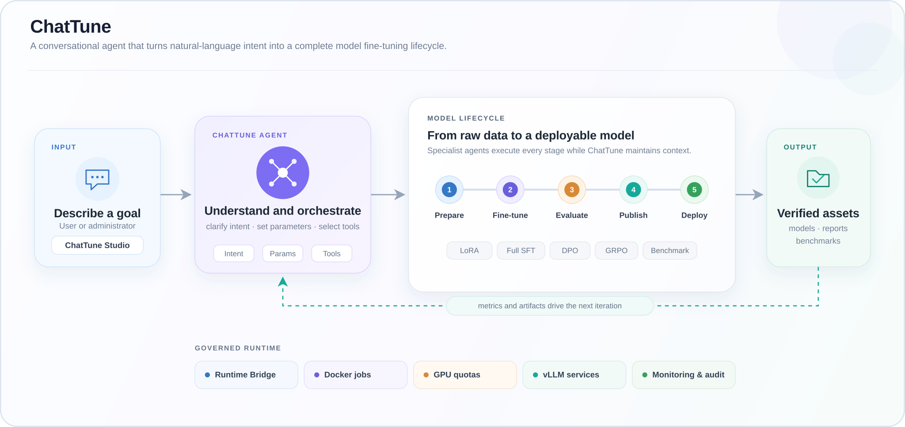

# MedFlow ChatTune

**The conversational fine-tuning agent: process data, train, evaluate, and deploy LLMs with natural language**

Healthcare-ready out of the box and extensible to general-purpose model training, evaluation, and deployment.

[](LICENSE)


[简体中文](README_ZH.md) · **English**

## What's New

- [2026-08-13] Inference is now managed through the resource pool, and the base training image was updated with LLaMA-Factory upgraded to 0.9.5.
- [2026-07-29] Initial release.

## What is MedFlow ChatTune?

MedFlow ChatTune is an open-source **conversational LLM fine-tuning agent** in the MedFlow product family. Instead of writing complex training scripts, users describe their goals in the web-based Studio and start data processing, fine-tuning, evaluation, publishing, inference deployment, and benchmark tasks through natural language.

ChatTune understands task intent, explains and collects required parameters, selects the appropriate training or evaluation tools, schedules Docker task containers, and continuously reports execution status. It turns a traditional command-line fine-tuning workflow into a conversational, observable, and manageable model-iteration process.

The project grew out of healthcare LLM practice and includes medical data strategies, medical evaluation integrations, and the MedFlow inference stack. Its core agent orchestration, training, resource management, and multi-user governance layers are not tied to a specific medical model and can be adapted to other domains.

> ⚠️ **Important**
>
> MedFlow ChatTune is currently intended for research, testing, and private deployment integration, and remains under active development. Production deployments require security hardening, access reviews, data-compliance assessment, and thorough model validation.

## Why ChatTune?

| Capability | Description |
| --- | --- |
| Conversational fine-tuning | Start jobs with natural language. When parameters are missing, the agent explains and requests them instead of requiring a complete training command. |
| End-to-end lifecycle | Connect data processing, training, evaluation, publishing, inference deployment, and benchmarking in a persistent, stoppable, resumable workflow. |
| Multiple training methods | Run LoRA SFT, full-parameter SFT, DPO-based enhancement, and GRPO on top of LLaMA-Factory and verl workflows. |
| Healthcare-ready, domain-flexible | Use the included medical strategies, benchmarks, and inference services, or replace datasets, templates, and evaluations for another domain. |
| Observable training | Inspect processes, stages, loss, progress, and W&B metadata, with AI-assisted training-curve analysis. |
| Resource and access governance | Manage users, groups, task containers, GPU pools, quotas, concurrency, resource sharing, and audit records. |
| Single machine to multiple nodes | Deploy the Runtime on one machine or as center/compute nodes; operate inference through controller/worker agents. |

## Architecture



The one-click workflow advances through:

```text
Train → Evaluate → Publish → Deploy → Benchmark
```

Each stage is persisted. Failed workflows can be inspected and resumed, while a workflow ID can be used to query or stop a specific run.

## Features

### Data and models

- Data preparation, SFT/DPO preprocessing, and advanced filtering.
- Built-in `inspection`, `diagnosis`, and `prescription` medical data strategies.
- Browse, preview, upload, download, and delete datasets, models, medical test sets, and evaluation results.
- Publish private resources, control sharing scopes, and support administrator approval.

### Training and evaluation

- LoRA SFT, full-parameter SFT, DPO/preference enhancement, and GRPO.
- Single-model, two-model comparison, and checkpoint evaluation.
- Preflight checks for parameters, model templates, Docker, GPU usage, and resource quotas.
- Status, progress monitoring, and controlled termination for training and evaluation jobs.
- Qwen3 templates are the default. Other models can be selected with `TEM` / `template` when supported by the chosen training image.

### Inference and benchmarks

- Inspect and modify model paths, ports, GPUs, tensor parallelism, memory utilization, and token limits.
- Start, stop, and restart inference services; inspect nodes, status, and logs.
- Run MedFlow functional tests, medical multiple-choice evaluations, MedBench, and general benchmarks.
- Bundled loaders and local resources include C-Eval, CMMLU, MMLU, MedQA, MedMCQA, and CMB-Single. These datasets retain their own license terms; see [NOTICE](NOTICE).

### Studio and governance

- Web chat, task status, training monitoring, data management, model management, and inference operations.
- Multi-user authentication, user groups, and Runtime-node assignment.
- GPU pools, guaranteed and maximum group quotas, concurrent-job limits, and reservation leases.
- Administrative, sharing, and approval audit trails.
- SQLite persistence with separate Runtime, node, and resource API tokens.

## Quick start

### 1. Prerequisites

- Linux, Bash, `setsid`, and `curl`
- Python 3.10 or later
- Node.js 20 or later and npm 10 or later
- Docker; real training and inference workloads require an available NVIDIA GPU environment
- An OpenAI-compatible model endpoint reachable by the agent
- Prepared Agent, training, evaluation/inference, and GRPO/verl task containers

Read the [Deployment Guide](docs/DEPLOYMENT.md) first for images, mounts, and inference configuration.

### 2. Install dependencies

From the repository root:

```bash
python -m pip install -r agent/requirements.txt
npm --prefix studio ci
npm --prefix agent-studio-runtime-bridge ci
```

### 3. Initialize a single-machine Runtime

```bash
bash runtime.sh init --profile single
```

To expose Studio to other machines:

```bash
bash runtime.sh init --profile single --iphost <reachable-host-ip>
```

Initialization creates `runtime.env`, which is excluded by `.gitignore` and contains local tokens and the initial administrator password. Never commit or publish this file.

### 4. Configure the environment

Open `runtime.env` and verify at least:

| Setting | Purpose |
| --- | --- |
| `MEDFLOW_LOCAL_TRAINING_CONTAINER` | Container for LoRA, full-parameter, DPO, and related training jobs. |
| `MEDFLOW_LOCAL_EVALUATE_CONTAINER` | Container for model evaluation and inference-related jobs. |
| `MEDFLOW_LOCAL_GRPO_CONTAINER` | GRPO/verl task container. |
| `MODEL_NAME` / `MODEL_API_KEY` / `MODEL_BASE_URL` | OpenAI-compatible endpoint used by the agent. |
| `INFERENCE_AGENT_URL` | `/inference_agent` endpoint of the inference controller. |
| `STUDIO_PUBLIC_URL` / `STUDIO_URL` | Browser-facing Studio URL and Runtime callback URL. |

### 5. Check and start

```bash
bash runtime.sh check
bash runtime.sh start
bash runtime.sh status
```

Open the `STUDIO_PUBLIC_URL` from `runtime.env` and sign in with the administrator credentials printed during initialization.

Common operations:

```bash
bash runtime.sh logs
bash runtime.sh logs agent
bash runtime.sh restart
bash runtime.sh stop
```

See the [Quickstart](docs/QUICKSTART.md) for the complete setup and troubleshooting flow.

## Conversation examples

Once signed in to Studio, try commands such as:

```text
Preprocess data with data_type=sft and strategy=diagnosis
Run LoRA batch training with MBS=1, ACC=8, and LR=1e-7
Run DPO enhancement with model_path=/path/to/model, dataset_dir=/path/to/data, dataset_name=my_dpo
Run a single-model evaluation with model_fir=/path/to/model
Show the current training status
Show inference status
Run inference benchmark 2024.json
Show the one-click workflow status
```

When required values are missing, the agent explains the fields and asks for them. It does not guess model, path, or checkpoint values.

## Deployment modes

| Mode | Use case | Initialization |
| --- | --- | --- |
| Single machine | Local validation, small teams, or an all-in-one server | `bash runtime.sh init --profile single` |
| Center node | Runs Studio and Bridge, with an optional local Agent API | `bash runtime.sh init --profile center --nodes ...` |
| Compute node | Runs the Agent API, resource probes, and task containers | `bash runtime.sh init --profile node ...` |

See [Multi-node Configuration](docs/MULTI_NODE.md) for tokens, URLs, and startup order. The current user guide marks multi-machine training as a later-stage capability; multi-node Runtime and multi-node inference should not be confused with distributed training.

## Adapting MedFlow to another domain

Healthcare-specific behavior is concentrated in the default data strategies, bundled evaluation resources, and the `medflow/` inference subproject. To adapt the platform to legal, financial, customer-service, or another vertical domain:

1. Replace the training data and choose an SFT, DPO, or GRPO workflow.
2. Select a template supported by the training image through `TEM` / `template`.
3. Connect domain-specific evaluations, reward logic, and benchmarks.
4. Point `MODEL_BASE_URL` to your OpenAI-compatible model service.
5. Reuse Studio, agent orchestration, container scheduling, monitoring, and resource governance.

## Repository layout

```text
.
├── runtime.sh                    # Initialization, checks, lifecycle, status, and logs
├── studio/                       # Web client/server, users, and resource management
├── agent/                        # Agent API, workflows, tools, and resource API
├── agent-studio-runtime-bridge/  # Bridge between Studio and Agent API backends
├── docker_scripts/               # Task-container scripts and evaluation resources
├── medflow/                      # Medical inference, inference agents, tests, benchmarks
└── docs/                         # Deployment, user, and administration documentation
```

## Documentation

| Document | Contents |
| --- | --- |
| [Documentation index](docs/README.md) | Recommended reading order and entry points |
| [Deployment Guide](docs/DEPLOYMENT.md) | Images, containers, mounts, and inference configuration |
| [Quickstart](docs/QUICKSTART.md) | Single-machine initialization, checks, startup, and logs |
| [User Guide](docs/USER_GUIDE.md) | Commands, workflows, training, evaluation, and inference |
| [Admin Guide](docs/ADMIN_GUIDE.md) | Groups, containers, GPU quotas, sharing, and audit |
| [Multi-node Configuration](docs/MULTI_NODE.md) | Center and compute node setup |

## Medical and data safety

This project does not provide medical advice and must not be the sole basis for diagnosis, prescriptions, or treatment. Any use involving real patients requires review by qualified professionals and compliance with applicable privacy, data-security, medical-device, and AI regulations.

Never commit real patient data, personally identifiable information, API keys, internal addresses, private model paths, or production logs to GitHub. Test and example data must be synthetic or properly de-identified.

## Origins and acknowledgements

This project originated from [MedFlow2025/medflow](https://github.com/MedFlow2025/medflow) and extends the Qingnang medical-model ecosystem ([ModelScope](https://modelscope.cn/models/MedFlow/Qingnang-32B-0630)) with fine-tuning, evaluation, resource governance, and Runtime capabilities.

We thank the following open-source projects and their contributors:

- [LLaMA-Factory](https://github.com/hiyouga/LlamaFactory) for SFT and DPO workflows.
- [verl](https://github.com/verl-project/verl) for GRPO workflows.
- [AgentScope](https://github.com/agentscope-ai/agentscope) for multi-agent and tool-calling foundations.

## Contributing

Issues and pull requests are welcome. Read [CONTRIBUTING.md](CONTRIBUTING.md) before contributing. Report security problems privately as described in [SECURITY.md](SECURITY.md), not through a public issue.

## License

Repository code is released under the [Apache License 2.0](LICENSE). Model weights, datasets, container images, cloud services, and some subprojects may have separate terms. See [NOTICE](NOTICE) for attribution and redistribution boundaries.
