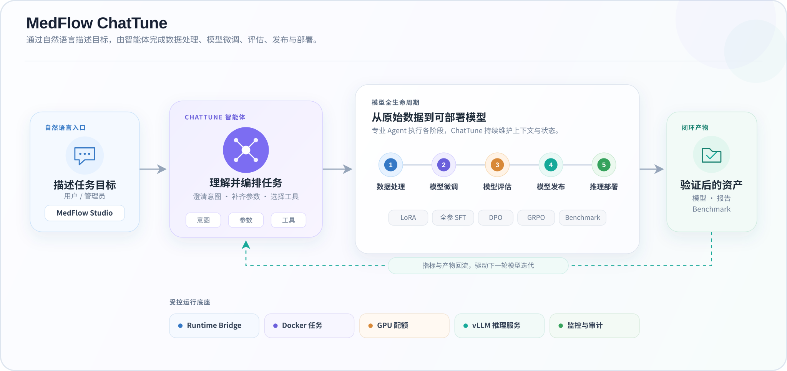

# MedFlow ChatTune

**对话式大模型微调智能体：用自然语言完成数据处理、训练、评估与部署**

面向医疗场景开箱即用，也可扩展为通用领域的模型训练、评估与部署平台。

[](LICENSE)


**简体中文** · [English](README.md)

## 最新更新

- [2026-08-20] 支持多机训练。
- [2026-08-13] 将推理纳入资源池管理中，同时更新底层训练镜像版本，LLaMA-Factory 升级到 0.9.5。
- [2026-07-29] 首次发布。

## 什么是 MedFlow ChatTune？

MedFlow ChatTune 是 MedFlow 产品体系中的开源 **对话式大模型微调智能体**。用户不需要手写复杂的训练脚本，只需在 Web Studio 中描述目标，即可通过自然语言发起数据处理、模型微调、评估、发布、推理部署和 Benchmark 任务。

ChatTune 会理解任务意图、解释并补齐必要参数、选择合适的训练或评估工具、调度 Docker 任务容器，并持续回传运行状态，把传统的命令行微调流程转化为可对话、可观察、可管理的模型迭代过程。

项目源于医疗大模型实践，内置医疗数据处理策略、医疗评测集成和 MedFlow 推理服务；核心的 Agent 编排、训练、资源管理和多用户治理能力不依赖特定医疗模型，也可用于其他垂直领域。

> ⚠️ **重要提示**
>
> MedFlow ChatTune 当前面向研发、测试与私有化部署集成，仍在持续迭代。生产使用前请完成安全加固、权限审查、数据合规评估和充分的模型验证。

## 为什么选择 ChatTune？

| 能力 | 说明 |
| --- | --- |
| 对话式微调 | 用自然语言启动任务；参数不足时 Agent 会解释并追问，而不是要求用户手写完整训练命令。 |
| 完整模型闭环 | 串联数据处理、训练、评估、发布、推理部署和基准评测，工作流状态可持久化、停止和恢复。 |
| 多种训练方式 | 支持 LoRA SFT、全参 SFT、DPO 增强训练和 GRPO；底层训练流程基于 LLaMA-Factory 与 verl。 |
| 医疗与通用兼容 | 提供医疗数据策略、Benchmark 和推理服务，也允许替换数据集、模型模板和评测集用于其他领域。 |
| 可观测训练 | 展示进程、阶段、Loss、进度和 W&B 信息，并支持基于训练曲线的 AI 分析。 |
| 资源与权限治理 | 提供用户、用户组、任务容器、GPU 资源池、配额、并发控制、资源共享和审计记录。 |
| 单机到多节点 | Runtime 支持单机或中心节点/计算节点部署；推理 Agent 支持 controller/worker 管理。 |

## 核心工作流



“一键工作流”会按顺序推进以下阶段：

```text
训练 → 模型评估 → 模型发布 → 推理部署 → Benchmark
```

每个阶段均有持久化状态。任务失败后可查看原因并继续执行，也可以通过工作流 ID 查询或停止指定任务。

## 功能一览

### 数据与模型

- 数据准备、SFT/DPO 预处理和高级筛选。
- 内置 `inspection`、`diagnosis`、`prescription` 医疗数据策略。
- 数据集、模型、医疗测试集和评估结果的查看、预览、上传、下载与删除。
- 私有资源发布、共享范围管理与管理员审批。

### 训练与评估

- LoRA SFT、全参 SFT、DPO/偏好增强训练和 GRPO。
- 单模型评估、双模型对比评估和 Checkpoint 评估。
- 启动前参数、模型模板、Docker、GPU 占用和资源配额检查。
- 训练与评估任务的状态查询、进度监控和安全停止。
- 默认适配 Qwen3 训练模板；其他模型可通过 `TEM` / `template` 显式指定，实际支持范围取决于所使用的训练镜像。

### 推理与 Benchmark

- 查看和修改模型路径、端口、GPU、张量并行度、显存比例和最大 Token 等配置。
- 启动、停止和重启推理服务，查询节点、状态与日志。
- 运行 MedFlow 功能测试、医疗选择题、MedBench 和通用 Benchmark。
- 仓库内置 C-Eval、CMMLU、MMLU、MedQA、MedMCQA 和 CMB-Single 数据加载资源；相关数据集适用各自许可证，详见 [NOTICE](NOTICE)。

### Studio 与平台治理

- Web 对话、任务状态、训练监控、数据管理、模型管理和推理运维面板。
- 多用户登录、用户组和 Runtime 节点绑定。
- GPU 资源池、用户组保底/最大配额、并发任务和预约租约。
- 管理操作、资源共享和审批审计。
- SQLite 持久化；Runtime token、节点 token 和资源 API token 相互隔离。

## 快速开始

### 1. 前置条件

- Linux、Bash、`setsid` 和 `curl`
- Python 3.10 或更高版本
- Node.js 20 或更高版本、npm 10 或更高版本
- Docker；执行真实训练和推理任务时需要可用的 NVIDIA GPU 环境
- 一个 Agent 可访问的 OpenAI-compatible 模型服务
- 已准备好的 Agent、训练、评估/推理和 GRPO/verl 任务容器

容器镜像、挂载目录和推理服务配置请先阅读 [部署指南](docs/DEPLOYMENT_ZH.md)。

### 2. 安装依赖

在项目根目录执行：

```bash
python -m pip install -r agent/requirements.txt
npm --prefix studio ci
npm --prefix agent-studio-runtime-bridge ci
```

### 3. 初始化单机 Runtime

```bash
bash runtime.sh init --profile single
```

如需从其他机器访问 Studio：

```bash
bash runtime.sh init --profile single --iphost <本机可达IP>
```

初始化会生成已被 `.gitignore` 排除的 `runtime.env`，其中包含本地 token 和初始管理员密码。请勿提交或公开该文件。

### 4. 配置运行环境

打开 `runtime.env`，至少确认以下配置：

| 配置 | 用途 |
| --- | --- |
| `MEDFLOW_LOCAL_TRAINING_CONTAINER` | LoRA、全参和 DPO 等常规训练任务容器。 |
| `MULTINODE_DOCKER_CONTAINER` | 多机 LoRA SFT 与 DPO 增强训练使用的独立 LLaMAFactory 容器。 |
| `MEDFLOW_LOCAL_EVALUATE_CONTAINER` | 模型评估与推理相关任务容器。 |
| `MEDFLOW_LOCAL_GRPO_CONTAINER` | GRPO/verl 任务容器。 |
| `MODEL_NAME` / `MODEL_API_KEY` / `MODEL_BASE_URL` | Agent 使用的 OpenAI-compatible 模型服务。 |
| `INFERENCE_AGENT_URL` | 推理 Agent controller 的 `/inference_agent` 地址。 |
| `STUDIO_PUBLIC_URL` / `STUDIO_URL` | 浏览器访问地址与 Runtime 回调地址。 |

### 5. 检查并启动

```bash
bash runtime.sh check
bash runtime.sh start
bash runtime.sh status
```

浏览器打开 `runtime.env` 中的 `STUDIO_PUBLIC_URL`，使用初始化输出的管理员账号登录。

常用运维命令：

```bash
bash runtime.sh logs
bash runtime.sh logs agent
bash runtime.sh restart
bash runtime.sh stop
```

完整步骤和故障检查见 [快速开始](docs/QUICKSTART_ZH.md)。

## 对话示例

登录 Studio 后，可以直接输入：

```text
执行数据预处理，data_type=sft，strategy=diagnosis
执行 LoRA 批量训练，MBS=1，ACC=8，LR=1e-7
执行增强训练，model_path=/path/to/model，dataset_dir=/path/to/data，dataset_name=my_dpo
执行单模型评估，model_fir=/path/to/model
查询当前训练状态
查看推理状态
运行推理基准测试 2024.json
查看一键工作流状态
```

当必要参数缺失时，Agent 会先说明字段含义并请求补充；路径、模型和 Checkpoint 参数不会被自动猜测。

## 部署模式

| 模式 | 适用场景 | 启动方式 |
| --- | --- | --- |
| 单机 | 本地验证、小团队或一体机部署 | `bash runtime.sh init --profile single` |
| 中心节点 | 运行 Studio、Bridge，并可选运行本机 Agent API | `bash runtime.sh init --profile center --nodes ...` |
| 计算节点 | 运行 Agent API、资源探测和任务容器 | `bash runtime.sh init --profile node ...` |

中心节点与计算节点的 token、地址、启动顺序以及多机训练所需的资源池配置见 [多机部署配置](docs/MULTI_NODE_ZH.md)。多机训练使用独立的 `MULTINODE_DOCKER_CONTAINER` 和 Studio 下发的 GPU 预约；多节点 Runtime 与多节点推理是相关部署模式，但配置入口不同。

## 用于通用领域

医疗能力主要集中在默认数据策略、内置评测资源和 `medflow/` 推理子项目。要用于法律、金融、客服或其他垂直领域，可以：

1. 替换训练数据，并选择 SFT、DPO 或 GRPO 流程。
2. 通过 `TEM` / `template` 选择训练镜像支持的模型模板。
3. 接入自己的评测集、奖励逻辑和 Benchmark。
4. 将 `MODEL_BASE_URL` 指向自己的 OpenAI-compatible 模型服务。
5. 保留 Studio、Agent 编排、容器调度、监控和资源治理能力。

## 项目结构

```text
.
├── runtime.sh                    # 初始化、检查、启停、状态与日志
├── studio/                       # Web 前端、后端、用户与资源管理
├── agent/                        # Agent API、工作流编排、工具与资源 API
├── agent-studio-runtime-bridge/  # Studio 与 Agent API 的桥接服务
├── docker_scripts/               # 任务容器创建与内置评测资源
├── medflow/                      # 医疗推理服务、推理 Agent、测试与 Benchmark
└── docs/                         # 部署、使用和管理文档
```

## 文档

| 文档 | 内容 |
| --- | --- |
| [文档索引](docs/README_ZH.md) | 推荐阅读顺序与文档入口 |
| [部署指南](docs/DEPLOYMENT_ZH.md) | 镜像、容器、目录挂载和推理配置 |
| [快速开始](docs/QUICKSTART_ZH.md) | 单机初始化、检查、启动和日志 |
| [用户指南](docs/USER_GUIDE_ZH.md) | 对话命令、工作流、训练、评估和推理 |
| [管理员指南](docs/ADMIN_GUIDE_ZH.md) | 用户组、容器、GPU 配额、共享和审计 |
| [多机部署](docs/MULTI_NODE_ZH.md) | 中心节点与计算节点配置 |

## 医疗与数据安全

本项目不构成医疗建议，不能作为诊断、处方或治疗的唯一依据。任何面向真实患者的使用都必须由具备资质的专业人员审核，并遵守适用的隐私、数据安全、医疗器械和人工智能监管要求。

请勿将真实患者数据、个人身份信息、API Key、内部地址、模型私有路径或生产日志提交到 GitHub。测试和示例数据应为合成数据或经过充分去标识化的数据。

## 项目来源与致谢

本项目源于 [MedFlow2025/medflow](https://github.com/MedFlow2025/medflow)，并围绕 Qingnang 系列医疗模型（[ModelScope](https://modelscope.cn/models/MedFlow/Qingnang-32B-0630)）扩展了微调、评估、资源治理和运行时能力。

感谢以下开源项目及其贡献者：

- [LLaMA-Factory](https://github.com/hiyouga/LlamaFactory)：SFT 与 DPO 训练流程。
- [verl](https://github.com/verl-project/verl)：GRPO 训练流程。
- [AgentScope](https://github.com/agentscope-ai/agentscope)：多 Agent 与工具调用基础能力。

## 参与贡献

欢迎提交 Issue 和 Pull Request。贡献前请阅读 [CONTRIBUTING.md](CONTRIBUTING.md)；安全问题请按 [SECURITY.md](SECURITY.md) 私下报告，不要创建公开 Issue。

## 许可证

本仓库代码以 [Apache License 2.0](LICENSE) 发布。模型权重、数据集、容器镜像、云服务及部分子项目可能适用独立条款；第三方归属和再分发边界见 [NOTICE](NOTICE)。
