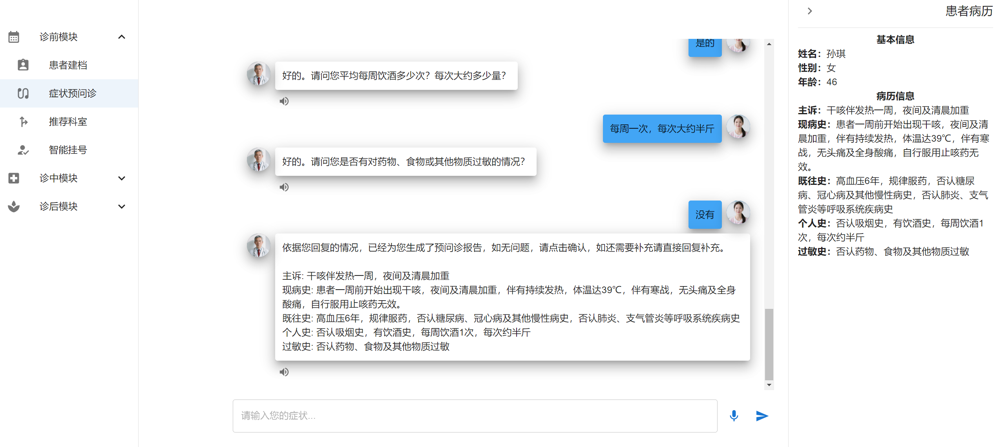
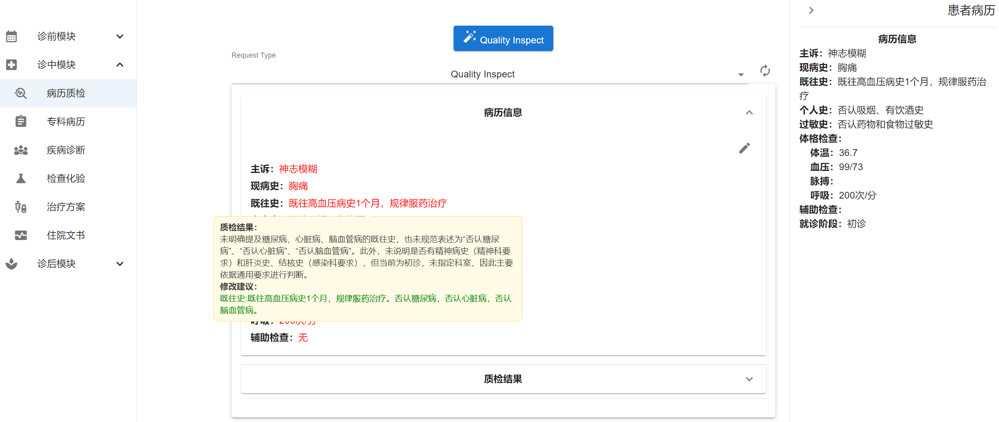
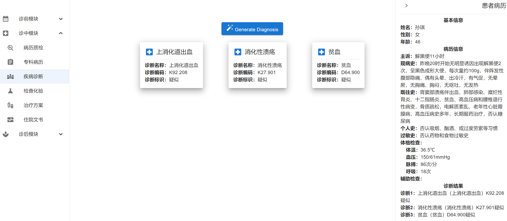
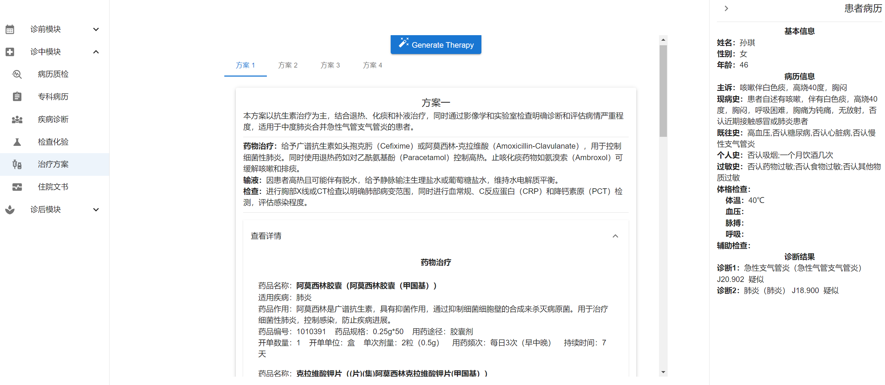
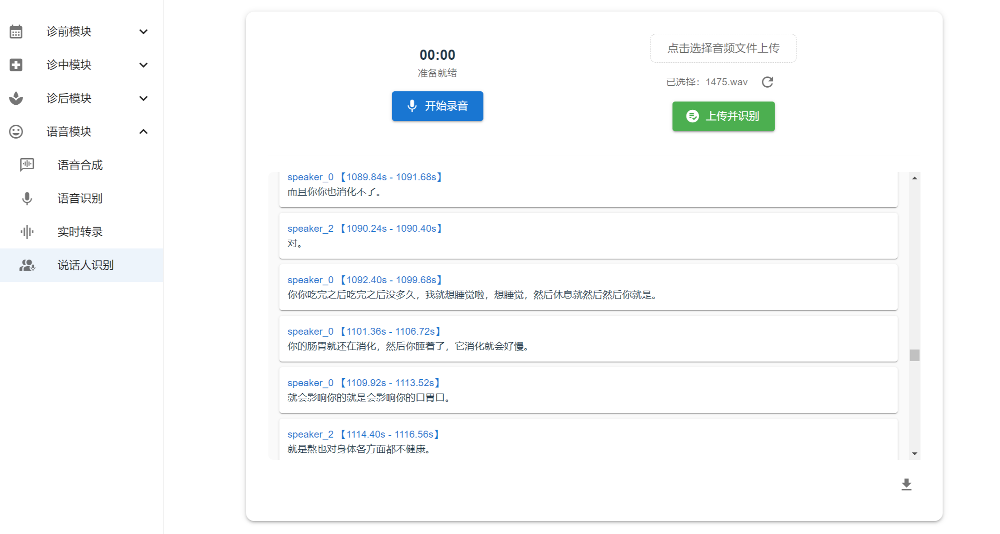

<div align="center">
<h1>
Qingnang Smart Diagnosis - MedFlow All - Process Medical Framework
</h1>
</div>

<div align="center">
  <a href="code_license">
    
  </a>
  <a href="model_license">
    
  </a>

 | [English](README.md) | [中文](README_CN.md) |
</div>


##  0. Latest News 🎉🎉

* [2025-03-28] Qingnang Smart Diagnosis - MedFlow All - Process Medical Framework published!
* [2025-09-16] Update the web interface, support ASR and TTS.


##  1. Introduction


Qingnang Smart Diagnosis is an **end-to-end AI healthcare framework** with **field-proven application capabilities**, designed to provide efficient and intelligent solutions for the medical industry. By integrating advanced large language model (LLM) technologies, this framework has realized core functions including intelligent triage, patient registration, medical record creation, diagnosis, ordering lab tests, prescriptions, and treatment plan development. We are dedicated to enhancing healthcare efficiency, improving patient experiences, and driving intelligent transformation in the medical industry.
With a focus on ease of use and adaptability, this framework supports seamless integration via APIs with leading LLMs such as DeepSeek, Qwen, Llama, and Baichuan. Whether deployed in cloud-based or on-premises environments, it enables rapid construction of **intelligent, healthcare-centric service systems**.

**Core Features**
+ End-to-End Interface: Supports HTTP service interfaces for pre-consultation, in-consultation, and post-consultation processes.
+ Flexible Data Integration: Enables customization of user-specific databases (e.g., drugs, disease names) and enhances implementation effectiveness through LLM + retrieval.
+ High-Compatibility Deployment: Allows direct access to various models via OpenAI services.
+ Multi-Scenario Adaptability: Covers diverse application scenarios such as hospitals, telemedicine, and pharmaceutical distribution.
+ Multi-Role Support: Offers comprehensive functionality for medical staff, patients, and administrators, streamlining workflows for all parties.

**Technical Advantages**
+ Agent Capabilities: Features meticulously optimized prompt instructions and reasoning workflow orchestration.
+ Key Challenge Solutions: Provides all solutions combining large model intent recognition, intent fallback, SQL distribution interfaces, and multi-channel retrieval.
+ Developer-Friendly Design: Focused on practical results, offering lightweight technical examples (e.g., intent, retrieval, database) with application tips for easy secondary development and upgrades.
+ Ready-to-Use: Comes pre-equipped with fine-tuned and enhanced training for medical domain-specific models.
+ Demo Interface: Visual business trial interface (user-friendly for non-technical personnel).

**Process Architecture**


##  2. Model Downloads


All large language models can be accessed via standard OpenAI services. Our compatibility testing has confirmed support for:
**Deepseek v3, Deepseek R1, Qwen2.5, Llama 3.1, Baichuan4, QwQ, etc**. For models with strong reasoning capabilities like Deepseek R1 and QwQ, format parsing components may require adjustments.


Our fine-tuned and enhanced medical large language models, along with voice interaction-based Chinese ASR, Cantonese ASR, and TTS models, are available via the following links:
			
|    Model     |  Foundational Model  |   Format   |         Download Link        |
| :----------: | :------: | :-------: |:---------------------------: |
| Qingnang-72B |    Qwen2.5-72B-Instruct    |    HuggingFace    | [ModelScope](https://modelscope.cn/models/MedFlow/Qingnang-72B) 
| Qingnang-9B |    GLM4-9B-Instruct    |    HuggingFace    | [ModelScope](https://modelscope.cn/models/MedFlow/Qingnang-9B) 
| Qingnang-ASR |    Whisper V3    |    HuggingFace    | [ModelScope](https://www.modelscope.cn/models/MedFlow/Qingnang-ASR)
| Qingnang-TTS |    GPT-Sovits2    |    HuggingFace    | [ModelScope](https://www.modelscope.cn/models/MedFlow/Qingnang-TTS)

After fine-tuning and enhanced training, our Medical Large Language Model A has achieved improvements in both medical professional capabilities and conversational interaction capabilities.
+ Using the authoritative medical evaluation benchmark MedBench, its medical professional capabilities have increased by 1.27% to 80.17% compared with the pre-training level.
+ Using clinical data to form a conversational evaluation dataset, its conversational interaction capabilities have increased by 0.95% to 85.65% compared with the pre-training level.

For detailed indicators, please refer to [Comparison_result.md](./docs/Comparison_result.md).

##  3. Main Features


**Main Features** 🏆


This framework demonstrates exceptional performance in two core functional modules— **Dialogue Interaction** and **Clinical Inference** —delivering benefits to hospitals, physicians, and patients:
+  **Intelligent Dialogue System**:
Enables precise and natural AI-driven patient-doctor interactions, supporting tasks such as patient registration, pre-consultation triage, and follow-up care through conversations with patients.
Supports medical record generation, quality check, and revision via dialogues with physicians.
+  **Clinical Reasoning Engine**:
Provides core reasoning capabilities including diagnosis, medication recommendations, and ordering lab tests.
Critical workflows achieve over 95% accuracy.

**Functional Module List**

|   Function     |  Process Stage  | Type  |  Users  |
| :----------: |:---------------: |:---------------: |:---------------: |
| Patient Registration  | Pre-consultation | Dialogue Interaction |  Patients, Hospitals  |
| Symptom Pre-Consultation  | Pre-consultation  | Dialogue Interaction |  Patients, Physicians  |
| Department Recommendation  | Pre-consultation  | Dialogue Interaction |  Patients, Hospitals  |
| Intelligent Appointment  | Pre-consultation  | Dialogue Interaction |  	Patients, Hospitals  |
| Medical Record Generation  | In-consultation  | Dialogue Interaction |  Physicians  |
| Specialist Record Gen.  | In-consultation  | Dialogue Interaction & Clinical Inference |  Physicians  |
| Medical Record QC  | In-consultation  | Dialogue Interaction & Clinical Inference |  Physicians, Hospitals  |
| Disease Diagnosis  | In-consultation  |  Clinical Inference  |  Physicians  |
| Medical Test Ordering  | In-consultation  |  Clinical Inference  | Physicians   |
| Treatment Plan Development  | 	In-consultation	  |  Dialogue Interaction & Clinical Inference  |  Physicians  |
| Inpatient Documents  | 	In-consultation	  |  Dialogue Interaction & Clinical Inference  |  Physicians  |
| Follow-up Management  | Post-consultation  |  Dialogue Interaction  |  Patients, Hospitals  |
| Follow-up Visit | Post-consultation  |  Dialogue Interaction  |  Patients, Hospitals  |


##  4. Quick Start


**4.1  Environment Configuration**

We recommend the following Docker/Conda environment configurations:
+ Ubuntu20.04、python3.12
+ NVIDIA-SMI 535.154.05、Driver Version: 535.154.05、CUDA Version: 12.2

You can use your own environment that meets the requirements, or launch a container via the following commands:

```bash
docker pull nvcr.io/nvidia/cuda:12.2.0-devel-ubuntu20.04
sudo docker run -itd --name <container_name> -v /home/<username>:/home/workspace --gpus all --ipc=host -v /root/.ssh:/root/.ssh --cap-add=SYS_PTRACE --privileged=true --ulimit stack=68719476736 --network host --shm-size=20G nvcr.io/nvidia/cuda:12.2.0-devel-ubuntu20.04 /bin/bash
```

**Code Download**

```bash
git clone -b dev https://github.com/MedFlow2025/medflow.git
```

**Dependency Installation**

Please confirm your Python version and run:

```bash
pip install -r requirements.txt
```

**4.2  Service Operation**


**OpenAI Service Preparation**

You need to deploy your models in advance using tools such as [ollama](https://ollama.com/)、[fastchat](https://github.com/lm-sys/FastChat)、[vllm](https://vllm.hyper.ai/docs/). We will also release deployment documentation for reference in the ./docs directory.

After deployment, your OpenAI-compatible service will have a URL similar to:

```bash
http://<openai ip>:<openai port>/v1 
```

**Data Preparation (Optional)**

We offer a function to import a custom knowledge base, which includes information about diagnoses, medicines, examination forms, etc. For specific examples, please refer to the [data_preparation.md](./docs/data_preparation.md). You can run the following script:

```bash
cd data
python3 create_database.py
```

We also provide a function to customize quality inspection rules. For specific examples, please refer to the [quality_base.json](./data/raw/json/quality/quality_base.json) and [quality.json](./data/raw/json/quality/quality.json) file. The changes will take effect after you modify the file and restart the service.

**Inference Service Startup**

```bash
python3 inference.py --model <model_name> --model-url http://<openai ip>:<port>/v1 --host <server ip> --port <server port> --max-tokens 4096
```

**WebUI Interface Startup**

1. Install dependencies

   ```
   cd web
   apt-get update && apt-get install npm mkcert
   npm install --production
   ```

2. Generate CA

   The parameter `${ip}` needs to be changed to the actual IP address.

   ```
   mkcert -key-file key.pem -cert-file cert.pem ${ip}
   ```

3. Start Server

   Make sure that the inference service and the voice service have been started, and modify the `host`, `port`, `inferport` and `voiceport` parameters in the script. Then run:

   ```
   node server.js
   ```

> Note:
>
> The old interface can be launched by using the following command:
>
> ```
> python3 inference_ui.py --host <server ip> --port <server port> --gradio-port <webui port> --model <model_name>
> ```

**Real-time voice transcription**

Start the real-time speech transcription server:

```
python3 realtime_transcription.py
```

> Note: Modify parameters such as `--host`, `--model-path`, `--ssl-cert`, and `--ssl-key` according to the actual situation. For the test script, you can refer to [test-realtime_transcription.py](./tests/test-realtime_transcription.py).

**Speaker recognition**

Start the speaker recognition service:

```
python3 speaker_diarization.py
```

> Note:Modify parameters such as `--host`, `--model-path`, `--sd-model-path`, `--ssl-cert`, and `--ssl-key` according to the actual situation. For the test script, you can refer to [test-speaker_diarization.py](./tests/test-speaker_diarization.py).

**4.3 Function Experience**


**Request Testing**

We provide documentation for curl request testing and scripts in the  [tests](./tests) directory. For detailed usage instructions, please refer to the [curl request instruction document](./docs/tests.md)..

```bash
cd ./tests

# Dialogue Generation for Patient Registration
bash test-clientinfo.sh <server ip> <server port>

# Dialogue Generation for Medical Guidance
bash test-hospitalguide.sh <server ip> <server port>

# Dialogue Generation for Pre - consultation Report
bash test-basicmedicalrecord.sh <server ip> <server port>

# Dialogue Generation for Appointment Booking
bash test-register.sh <server ip> <server port>

# Diagnosis Generation
bash test-diagnosis.sh <server ip> <server port>

# Generation of Examinations and Tests
bash test-examineassay.sh <server ip> <server port>

# Generation of Treatment Plan
bash test-therapyscheme.sh <server ip> <server port>

# Dialogue Generation for Return Visit
bash test-returnvisit.sh <server ip> <server port>

# Medical Record Generation
bash test-doctormedicalrecord.sh <server ip> <server port>

# Generation of Inpatient Documents
bash test-inpatient.sh <server ip> <server port>

# Follow-up
bash test-followup.sh <server ip> <server port>
```

**Webui Experience**

You can open the URL prompted after starting the WebUI interface to experience the functions of each module:
```bash
https://<webui ip>:<webui port>
```












##  5. Statement of Agreement

+ The use of this framework's code and models must comply with the [Apache 2.0 open-source license](https://github.com/MedFlow2025/medflow/blob/master/LICENSE). Commercial use is permitted without requiring authorization. Please review and adhere to the following:
Prohibited Uses:
Do not use open-source models, code, or derivatives thereof for any purpose that may harm the country and society.
Do not deploy these resources for services that have not undergone security assessments and filings.

+ Although measures have been taken during training to ensure data compliance and accuracy, due to the large parameter size of the models and probabilistic randomness factors, we cannot guarantee the accuracy of outputs. The models are also susceptible to input instruction biases. This project assumes no liability for risks related to data security, public opinion risks, or consequences arising from model manipulation, misuse, dissemination, or improper utilization.
**You will assume full responsibility for all risks and consequences arising from the use, reproduction, distribution, and modification of the models and other components of this open-source project.**

##  6. Contact Information


+ This framework has been field-deployed in multiple top-tier hospitals across China. 🚀
+ For any issues or suggestions during use, please submit them via **the GitHub Issues page of this project**—we will respond promptly!
+ For medical or other domain data processing, routine training, or enhancement training, we recommend using **the EPAI platform** (Enhanced Platform for AI Innovation)!
+ For private hospital deployments or HIS (Hospital Information System)-related customization needs, **our partner with experienced medical vendors**: https://www.skytek.com.cn. Contact us for referrals!
+ We aspire to drive transformative changes in healthcare through large model inference deployments, delivering superior services to patients and medical staff. We sincerely invite your participation and support!
